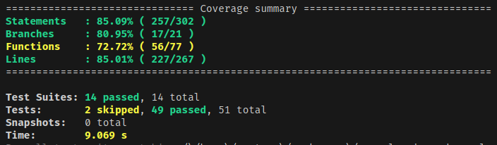

# MarvelApiCrudAngular

This project was generated using [Angular CLI](https://github.com/angular/angular-cli) version 19.1.4.

## Development server

To start a local development server, run:

```bash
npm test
```

Once the server is running, open your browser and navigate to `http://localhost:4200/`.

## Running unit tests

To execute unit tests with the [Jest](https://jestjs.io/) test runner, use the following command:

```bash
ng test
```

## Additional Resources

For more information on using the Angular CLI, including detailed command references, visit the [Angular CLI Overview and Command Reference](https://angular.dev/tools/cli) page.

## Tests coverage


